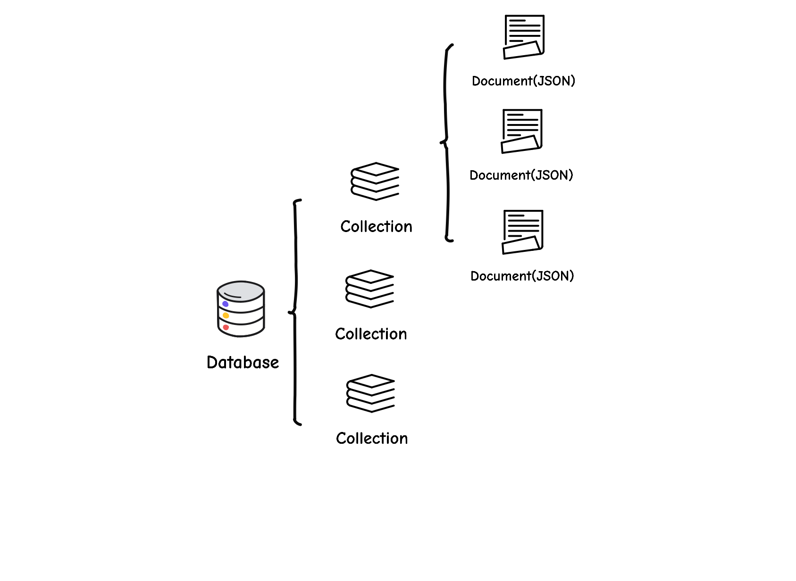

# Quick start

## Open a database

### Filesystem backend

With the filesystem backend, PoloDB stores data in ONE file.
All the data are saved persistently on the disk.

```rust
use polodb_core::Database;

let mut db = Database::open_file("/tmp/test-polo.db").unwrap();
```

### Memory backend

With the memory backend, all the data all stored in memory, making PoloDB a pure memory database.

```rust
use polodb_core::Database;

let mut db = Database::open_memory().unwrap();
```

## Collection



A **Collection** is a dataset of a kind of data.
You can use `create_collection` to create a data collection.
To obtain an exist collection, use the method `collection`.

```rust
let test_collection = db.collection("test").unwrap();
```

## Document

A document is a row of JSON data in PoloDB.
PoloDB uses an extended JSON which supports extended types such as Data and ObjectID.

PoloDB uses the property `_id` as the primary key of the row of the data.
If the document doesn't have an id, PoloDB will generate one automatically.
Internally, PoloDB uses [msgpack](https://msgpack.org/) to encode the data, which is small an fast.

An document can be constructed by the macro:

```rust
let keys = doc! {
  "user_id": 1,
};
```

## Transaction

You an manually start a transaction by `start_transaction` method.
If you don't start it manually, a transaction will be automatically started
in your every operation.
