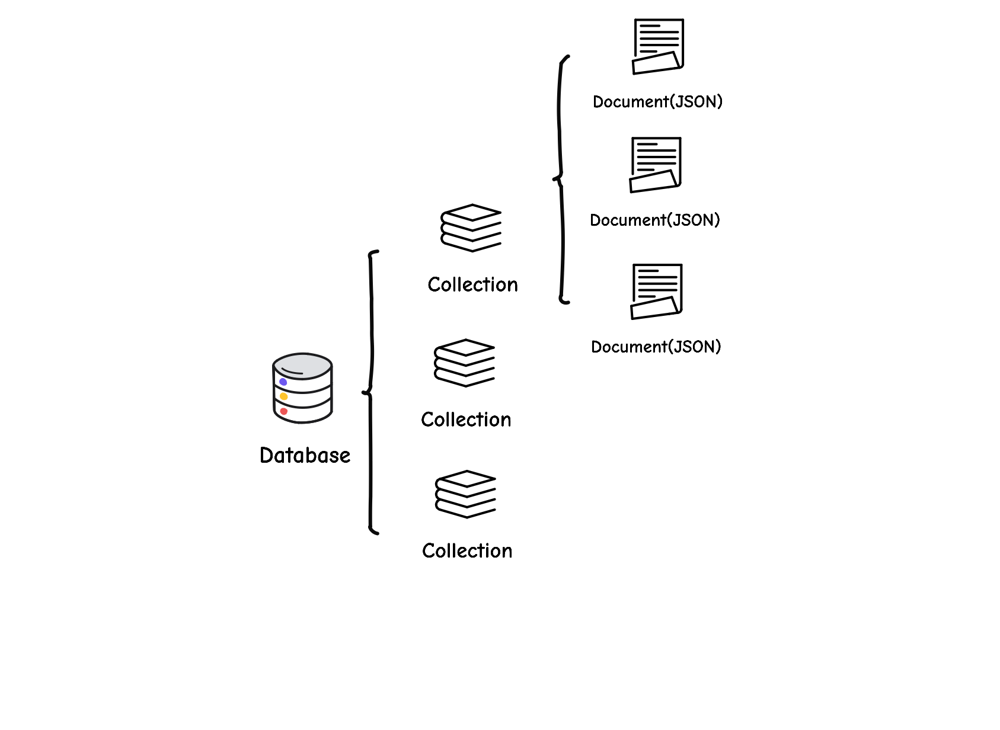

import { Callout } from 'nextra-theme-docs'

# Quick start

This guide targets **PoloDB v5.2.0**.

## Open a database

PoloDB stores persistent data in a RocksDB-backed directory. The path passed to
`open_path` is a database directory, not a single database file.

```rust
use polodb_core::{
    bson::{doc, Document},
    CollectionT, Database,
};

fn main() -> Result<(), Box<dyn std::error::Error>> {
    let db = Database::open_path("./polodb-data")?;
    let books = db.collection::<Document>("books");

    books.insert_one(doc! {
        "title": "1984",
        "author": "George Orwell",
    })?;

    Ok(())
}
```

<Callout type="warning" emoji="⚠️">
  Do **NOT** open a database on a network volume.
</Callout>

## Collection



A **Collection** is a dataset of a kind of data.
Use `collection` to obtain a typed collection handle.

```rust
let books = db.collection::<Document>("books");
books.insert_one(
    doc! { "title": "1984", "author": "George Orwell" },
)?;
```

## Document

A document is a BSON record in PoloDB. BSON supports additional types such as
dates, binary data, and object IDs.

PoloDB uses the `_id` field as the document's primary key. If a document does
not have an `_id`, PoloDB generates one automatically. Internally, PoloDB uses
[BSON](https://bsonspec.org/) to encode documents.

A document can be constructed with the `doc!` macro:

```rust
let keys = doc! {
    "user_id": 1,
};
```
